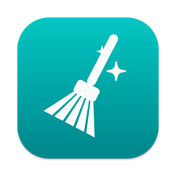
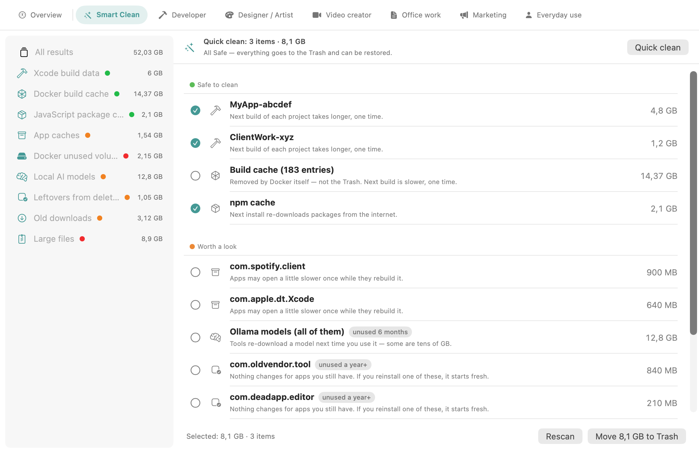
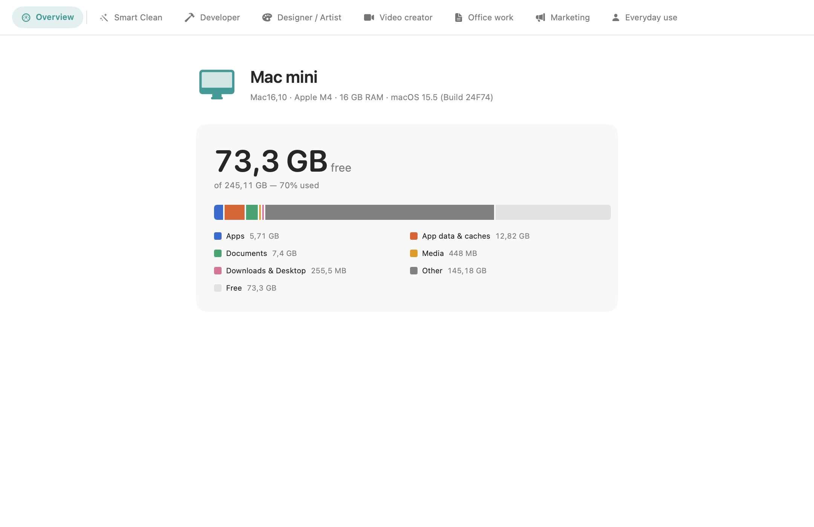

<div align="center">



# Sweep

**A calm storage cleaner for macOS.** Scan by what you actually do, review by
honest risk levels, clean to the Trash.

[](https://github.com/akatekhanh/sweep/actions/workflows/ci.yml)
[](LICENSE)


</div>

Most Mac cleaners make money by making you nervous: red totals, "health
scores", one big button that deletes things it never names. Sweep does the
opposite. It shows you what it found, tells you in plain language what happens
if you clean it, pre-selects only what it can put back, and never deletes
anything you didn't click.



## What makes it different

There are good open-source Mac cleaners now — several appeared in 2025–2026, and
some of them already do risk tiers and trash-only deletion. Here is what Sweep
does that they don't, stated narrowly enough to check:

- **Docker, broken out into the five things you'd actually decide about
  separately** — build cache, dangling images, stopped containers, unused
  images, unused volumes — read from `docker system df`, each with its own risk
  level. Other tools either offer one "Docker" row worth 20 GB, or run
  `docker system prune -f` on your behalf. Volumes are labelled by their Compose
  project (`myproject / pgdata`), not by a 64-character hash.
- **Local AI model stores as a first-class category**, all five of them: Ollama,
  LM Studio, Hugging Face, PyTorch, Whisper — the *model files*, not just their
  logs. These are the caches that quietly reach tens of GB.
- **It knows what iCloud syncs.** Deleting a synced file removes it from your
  other devices, so those items are badged, get their own warning line, and stay
  out of quick clean. (The macOS ubiquity APIs report nothing for a synced
  `~/Desktop`; Sweep detects it anyway.)
- **Nothing without an undo is ever pre-selected.** A Docker build cache is
  "safe" — it rebuilds itself — but it never lands in the Trash, so Sweep leaves
  it unticked. Every removal that isn't recoverable says so in the row, and the
  commit button changes wording as soon as one is selected.
- **Role-based scanning inside a native app**, so a video editor is never asked
  about DerivedData and a developer is never shown their Movies folder.

And the things a careful cleaner should do anyway:

- **Every item says what happens next.** Not "frees up space", but "Next build
  of each project takes longer, one time."
- **Three honest risk levels.** Safe (regenerates itself) · Worth a look (has a
  real re-download or rebuild cost) · Risky (your actual data — opt in per item).
- **One button, not a hundred checkboxes.** *Quick clean* cleans every Safe,
  recoverable item it found. It's the only bulk control; there is no "select all".
- **It tells you what's gone stale.** Items nothing has read in months carry an
  "unused 8 months" badge, taken from the filesystem's access date — a cache
  read yesterday is in use no matter how old it looks.
- **Recoverable by design.** Cleaning is `FileManager.trashItem`. If you regret
  it, open the Trash.
- **No dark patterns.** No urgency copy, no red totals, no health score, no
  nagging, no telemetry, no network calls at all.

## Tabs

**Overview** — which Mac this is and where the space went:



Then **Smart Clean** (everything) and one tab per role, so you can sweep the
machine role by role: Developer · Designer/Artist · Video creator · Office work ·
Marketing · Everyday use.

## What it can clean

| | |
|---|---|
| **Developer** | Xcode DerivedData, iOS device support, simulator caches, npm/yarn/pnpm, pip/uv, Cargo + rustup, Go modules + build cache, Homebrew, CocoaPods, Gradle/Maven, editor caches (VS Code / Cursor / JetBrains) |
| **Container VMs** | Colima, Lima, Podman, OrbStack, Rancher Desktop disk images — usually the single biggest file on a developer's Mac, and invisible to cache cleaners |
| **Docker** | build cache, dangling images, stopped containers, unused images, unused volumes — scanned through `docker system df` |
| **Local AI** | Ollama, LM Studio, Hugging Face, PyTorch, Whisper model stores |
| **Creative** | Adobe media cache, Final Cut render files, Sketch/Figma caches, font caches |
| **Leftovers** | settings and caches of apps you already deleted, found by matching bundle ids against what's installed |
| **Everyday** | browser caches, Zoom/Teams and Slack/Discord/Signal caches, old downloads, screenshots, screen recordings, Mail attachment cache, Trash |
| **Risky, opt-in** | large files in your folders, iPhone/iPad backups |

**Docker is the one exception to "everything is recoverable".** Docker has no
trash: removal goes through the docker CLI and is permanent. So those categories
are marked as such, their consequence text says "not the Trash", they're never
pre-selected, and the commit button changes from *Move X to Trash* to *Clean X*
the moment one is selected. If Docker isn't running, Sweep only offers the whole
virtual disk file instead — which does go to the Trash.

## Install

Download the latest `Sweep-macOS.zip` from
[Releases](https://github.com/akatekhanh/sweep/releases), unzip, and drag
`Sweep.app` to `/Applications`.

**The build is unsigned**, because notarizing requires a paid Apple Developer
account. macOS will refuse to open it the first time ("Apple could not verify
…"). To get past it:

> Right-click (or Control-click) `Sweep.app` → **Open** → **Open**.

You only do this once. Or, if you prefer the command line, remove the quarantine
flag that Safari/Chrome attached to the download:

```sh
xattr -d com.apple.quarantine /Applications/Sweep.app
```

Don't disable Gatekeeper system-wide (`spctl --master-disable`) — that lowers
the bar for every app on your Mac, not just this one.

### Full Disk Access

Some categories (Safari cache, Mail attachments) live in places macOS protects.
Without **System Settings → Privacy & Security → Full Disk Access**, those
categories simply show as empty — nothing breaks, they just find nothing.

## Build from source

Command Line Tools are enough; Xcode is only needed for `swift test`.

```sh
git clone https://github.com/akatekhanh/sweep.git
cd sweep
swift run SweepApp          # run it
swift run SweepChecks       # the full check suite (no Xcode needed)
swift test                  # same assertions via Swift Testing (needs Xcode)
./scripts/make-app.sh       # release bundle → dist/Sweep.app
```

Other useful commands:

```sh
swift scripts/gen-icon.swift                            # regenerate the app icon
SWEEP_SNAPSHOT_DIR=docs/screenshots swift run SweepApp   # regenerate screenshots
```

## Architecture

Clean Architecture, dependency rule pointing inward:

```
Sources/SweepCore   domain — entities, risk levels, catalog, use cases (Foundation only)
Sources/SweepInfra  adapters — read-only scanners, Docker CLI, Trash service
Sources/SweepApp    SwiftUI + MVVM, composition root
Sources/SweepChecks dependency-free check runner (CI gate)
Tests/              Swift Testing: domain + infra, against temp directories
```

The UI never touches the filesystem. Scanners implement the `CategoryScanner`
port and are injected into `ScanUseCase`; they only ever read. Cleaning happens
in exactly one place, `CleanUseCase`, which routes each item either to the Trash
or — for Docker — to the tool that owns it.

Adding something to clean is usually three small edits, all described in
[CONTRIBUTING.md](CONTRIBUTING.md). The full product spec and the reasoning
behind each risk level is in [docs/DESIGN.md](docs/DESIGN.md).

## Contributing

Issues and PRs welcome — please read [CONTRIBUTING.md](CONTRIBUTING.md) first,
especially the six rules a change has to respect. Found a way to make Sweep
delete the wrong thing? That's a security issue: see [SECURITY.md](SECURITY.md).

## License

[MIT](LICENSE) © 2026 Quoc Khanh

Sweep moves files to the Trash and can remove Docker objects permanently. It
comes with no warranty of any kind — read what you're about to clean.
